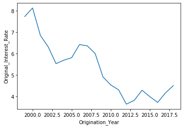

---

## Interpretation of coefficients.

- Model 1: 
    - When co-borrower credit score rises by 1%, interest rates, all else equal, fall by 1.49 percentage points. 
    - When the 10 year treasury rate increases by 1, interest rates, all else equal, increase by 0.95 percentage points. 
    - First time homebuyers, all else equal, pay interest rates that are 0.15 percentage points higher. 
- Model 2B: 
    - Beta 0 means: A 1% increase in credit score, all else equal, is associated with interest rates that are 3.84 p.p. higher _**when log(LTV) is zero.**_ 
    - Beta 2 means, first pass: _A 1% increase in credit score, all else equal, is associated with interest rates that are "2.40 times log(LTV)" percentage points lower._ 
    - Beta 2 means, second pass: The average log(LTV) is 4.21, so for a loan with average log(LTV), a 1% increase in credit score, all else equal, is associated with interest rates that are 10.1 percentage points lower.
- Why did the credit score coefficient change so much between 2A and 2B?
  - In model 2A, the total relationship between credit score and rates is summarized by beta 0. A 1% increase in score is related to a 6.28 p.p. fall in rates.
  - In model 2B, the total relationship between credit score and rates is summarized by beta 0 + beta 2 * log(LTV). If we take the average log(LTV), then 3.84-2.4*4.21 = a 6.26 p.p. fall in rates.
  - So: While the coefficient on beta0 changed, the total implied relationship is nearly identical between 2A and 2B! 

## Regression coefficients

There are two acceptable answers depending on whether you dropped the "u" first time home buyers permanently or not

_(I dropped all the coefficients from model 4B to make this table shorter, as they aren't necessary for grading purposes. )_

### Version 1 - dropped those obs from all models

<table ><tr>                    <td></td>                      <td>Q1</td>       <td>Q2A</td>      <td>Q2B</td>       <td>Q3</td>       <td>4A</td>        <td>4B1</td>  </tr><tr>  <td>Intercept</td>                            <td>11.72***</td> <td>45.76***</td> <td>-21.42***</td>  <td>5.66***</td> <td>387.92***</td>  <td>7.73***</td></tr><tr>  <td></td>                                      <td>(0.20)</td>   <td>(0.46)</td>   <td>(6.45)</td>    <td>(0.10)</td>   <td>(0.75)</td>    <td>(0.02)</td> </tr><tr>  <td>First_time_home_buyer_indicator[T.Y]</td>  <td>0.15***</td>     <td></td>         <td></td>          <td></td>         <td></td>          <td></td>    </tr><tr>  <td></td>                                      <td>(0.01)</td>      <td></td>         <td></td>          <td></td>         <td></td>          <td></td>    </tr><tr>  <td>TCMR</td>                                  <td>0.95***</td>     <td></td>         <td></td>          <td></td>         <td></td>          <td></td>    </tr><tr>  <td></td>                                      <td>(0.00)</td>      <td></td>         <td></td>          <td></td>         <td></td>          <td></td>    </tr><tr>  <td>l_coscore</td>                            <td>-1.49***</td> <td>-6.28***</td>  <td>3.84***</td>      <td></td>         <td></td>          <td></td>    </tr><tr>  <td></td>                                      <td>(0.03)</td>   <td>(0.07)</td>   <td>(0.97)</td>       <td></td>         <td></td>          <td></td>    </tr><tr>  <td>l_LTV</td>                                    <td></td>      <td>0.22***</td> <td>16.12***</td>   <td>0.23***</td>     <td></td>          <td></td>    </tr><tr>  <td></td>                                         <td></td>      <td>(0.01)</td>   <td>(1.52)</td>    <td>(0.01)</td>      <td></td>          <td></td>    </tr><tr>  <td>l_coscore:l_LTV</td>                          <td></td>         <td></td>     <td>-2.40***</td>      <td></td>         <td></td>          <td></td>    </tr><tr>  <td></td>                                         <td></td>         <td></td>      <td>(0.23)</td>       <td></td>         <td></td>          <td></td>    </tr><tr>  <td>creditbins[T.Fair]</td>                       <td></td>         <td></td>         <td></td>      <td>-0.64***</td>     <td></td>          <td></td>    </tr><tr>  <td></td>                                         <td></td>         <td></td>         <td></td>       <td>(0.08)</td>      <td></td>          <td></td>    </tr><tr>  <td>creditbins[T.Good]</td>                       <td></td>         <td></td>         <td></td>      <td>-1.17***</td>     <td></td>          <td></td>    </tr><tr>  <td></td>                                         <td></td>         <td></td>         <td></td>       <td>(0.08)</td>      <td></td>          <td></td>    </tr><tr>  <td>creditbins[T.Very Good]</td>                  <td></td>         <td></td>         <td></td>      <td>-1.63***</td>     <td></td>          <td></td>    </tr><tr>  <td></td>                                         <td></td>         <td></td>         <td></td>       <td>(0.08)</td>      <td></td>          <td></td>    </tr><tr>  <td>creditbins[T.Exceptional]</td>                <td></td>         <td></td>         <td></td>      <td>-2.21***</td>     <td></td>          <td></td>    </tr><tr>  <td></td>                                         <td></td>         <td></td>         <td></td>       <td>(0.08)</td>      <td></td>          <td></td>    </tr><tr>  <td>Origination_Year</td>                         <td></td>         <td></td>         <td></td>          <td></td>     <td>-0.19***</td>      <td></td>    </tr><tr>  <td></td>                                         <td></td>         <td></td>         <td></td>          <td></td>      <td>(0.00)</td>       <td></td>    </tr><tr> ><tr>  <td>R-squared</td>                              <td>0.84</td>     <td>0.12</td>     <td>0.13</td>      <td>0.12</td>     <td>0.66</td>      <td>0.85</td>  </tr><tr>  <td></td>                                       <td>0.84</td>     <td>0.12</td>     <td>0.13</td>      <td>0.12</td>     <td>0.66</td>      <td>0.85</td>  </tr><tr>  <td>R-squared</td>                              <td>0.84</td>     <td>0.12</td>     <td>0.13</td>      <td>0.12</td>     <td>0.66</td>      <td>0.85</td>  </tr><tr>  <td>No. observations</td>                       <td>67342</td>    <td>67342</td>    <td>67342</td>     <td>67342</td>   <td>134970</td>    <td>134970</td> </tr></table>
  
  
### Version 2 - kept them

<table class="simpletable"><tr>                    <td></td>                      <td>Q1</td>       <td>Q2A</td>      <td>Q2B</td>       <td>Q3</td>       <td>4A</td>        <td>4B1</td>  </tr><tr>  <td>Intercept</td>                            <td>11.72***</td> <td>45.75***</td> <td>-21.43***</td>  <td>5.65***</td> <td>388.06***</td>  <td>7.73***</td></tr><tr>  <td></td>                                      <td>(0.20)</td>   <td>(0.46)</td>   <td>(6.45)</td>    <td>(0.10)</td>   <td>(0.75)</td>    <td>(0.02)</td> </tr><tr>  <td>First_time_home_buyer_indicator[T.Y]</td>  <td>0.15***</td>     <td></td>         <td></td>          <td></td>         <td></td>          <td></td>    </tr><tr>  <td></td>                                      <td>(0.01)</td>      <td></td>         <td></td>          <td></td>         <td></td>          <td></td>    </tr><tr>  <td>TCMR</td>                                  <td>0.95***</td>     <td></td>         <td></td>          <td></td>         <td></td>          <td></td>    </tr><tr>  <td></td>                                      <td>(0.00)</td>      <td></td>         <td></td>          <td></td>         <td></td>          <td></td>    </tr><tr>  <td>l_coscore</td>                            <td>-1.49***</td> <td>-6.28***</td>  <td>3.84***</td>      <td></td>         <td></td>          <td></td>    </tr><tr>  <td></td>                                      <td>(0.03)</td>   <td>(0.07)</td>   <td>(0.97)</td>       <td></td>         <td></td>          <td></td>    </tr><tr>  <td>l_LTV</td>                                    <td></td>      <td>0.23***</td> <td>16.12***</td>   <td>0.23***</td>     <td></td>          <td></td>    </tr><tr>  <td></td>                                         <td></td>      <td>(0.01)</td>   <td>(1.52)</td>    <td>(0.01)</td>      <td></td>          <td></td>    </tr><tr>  <td>l_coscore:l_LTV</td>                          <td></td>         <td></td>     <td>-2.40***</td>      <td></td>         <td></td>          <td></td>    </tr><tr>  <td></td>                                         <td></td>         <td></td>      <td>(0.23)</td>       <td></td>         <td></td>          <td></td>    </tr><tr>  <td>creditbins[T.Fair]</td>                       <td></td>         <td></td>         <td></td>      <td>-0.63***</td>     <td></td>          <td></td>    </tr><tr>  <td></td>                                         <td></td>         <td></td>         <td></td>       <td>(0.08)</td>      <td></td>          <td></td>    </tr><tr>  <td>creditbins[T.Good]</td>                       <td></td>         <td></td>         <td></td>      <td>-1.17***</td>     <td></td>          <td></td>    </tr><tr>  <td></td>                                         <td></td>         <td></td>         <td></td>       <td>(0.08)</td>      <td></td>          <td></td>    </tr><tr>  <td>creditbins[T.Very Good]</td>                  <td></td>         <td></td>         <td></td>      <td>-1.63***</td>     <td></td>          <td></td>    </tr><tr>  <td></td>                                         <td></td>         <td></td>         <td></td>       <td>(0.08)</td>      <td></td>          <td></td>    </tr><tr>  <td>creditbins[T.Exceptional]</td>                <td></td>         <td></td>         <td></td>      <td>-2.21***</td>     <td></td>          <td></td>    </tr><tr>  <td></td>                                         <td></td>         <td></td>         <td></td>       <td>(0.08)</td>      <td></td>          <td></td>    </tr><tr>  <td>Origination_Year</td>                         <td></td>         <td></td>         <td></td>          <td></td>     <td>-0.19***</td>      <td></td>    </tr><tr>  <td></td>                                         <td></td>         <td></td>         <td></td>          <td></td>      <td>(0.00)</td>       <td></td>    </tr><tr>                                       <td>0.84</td>     <td>0.12</td>     <td>0.13</td>      <td>0.12</td>     <td>0.66</td>      <td>0.85</td>  </tr><tr>  <td>R-squared</td>                              <td>0.84</td>     <td>0.12</td>     <td>0.13</td>      <td>0.12</td>     <td>0.66</td>      <td>0.85</td>  </tr><tr>  <td>No. observations</td>                       <td>67342</td>    <td>67366</td>    <td>67366</td>     <td>67366</td>   <td>135038</td>    <td>135038</td> </tr></table>
